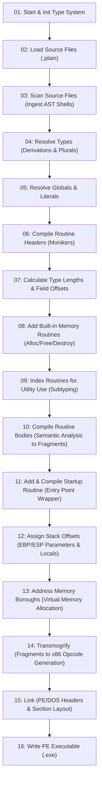

# Comprehensive Architecture & Compiler Pipeline Documentation: Plain English Compiler

This document provides a deep, technical breakdown of the self-hosting **Plain English Compiler** implemented in [Plain English Compiler.plain](file:///c:/Plain-English-Compiler/Compiler/Plain%20English%20Compiler.plain). It covers the design philosophy, memory model, intermediate structures, and each of the 16 core compilation stages—explaining what the code executes, the engineering rationale, and the trade-offs involved.

---

## 1. Architectural Philosophy & Overview

### 1.1 Natural-Language Programming Model
The Plain English language uses an English-like syntax designed around prose readability. Unlike traditional programming languages that rely on LL/LR/LALR grammar tables, Plain English structures programs using:
- **Types**: Custom records, scalar primitives, pointers, and heap-allocated linked lists (`things`).
- **Globals**: Module/program-level state with optional literal initialization.
- **Routines**: Procedures, functions, and decision predicates (`decider` routines returning boolean flags). Routine headers and call sites read like natural sentences.

### 1.2 Multi-Pass Architecture
Because natural English allows words, synonyms, and forward references across types and routines without header declarations, the compiler employs a strict **16-stage pipeline**. Rather than resolving everything in a single streaming pass, symbols, types, and bodies are ingested and progressively refined.

### 1.3 Memory Layout and PE Binary Generation
The Plain English compiler targets **32-bit Windows PE executables (x86)** natively without external linkers (like GNU `ld` or Microsoft `link.exe`). Memory in the resulting image is divided into three distinct **boroughs** aligned to 4096-byte boundaries:
1. **Import Borough (`.idata`)**: Windows API import directory tables, lookup thunks, and DLL name strings.
2. **Data Borough (`.data`)**: Global variable slots and literal constant pools.
3. **Code Borough (`.code`)**: Executable 32-bit x86 machine instructions.

---

## 2. Compiler Pipeline Summary

The master pipeline is coordinated in `To compile a directory:` ([lines 357–375](file:///c:/Plain-English-Compiler/Compiler/Plain%20English%20Compiler.plain#L357-L375)):

---

## 3. Detailed Stage-by-Stage Documentation

---

### Stage 01: Compiler Initialization & Built-in Types
- **Location**: [lines 425–520](file:///c:/Plain-English-Compiler/Compiler/Plain%20English%20Compiler.plain#L425-L520) (`To compile a directory (start):`)
- **Key Functions**: `Initialize the compiler given the directory`, `Add the built-in types`

#### What the Code Does
1. Wipes all data structures and hash indexes from prior runs (`Destroy the utility index`, `routine index`, `type index`, etc.).
2. Creates core hash tables sized using prime bucket counts (e.g., 4027 buckets for types and globals, 7919 for routines) to ensure uniform hash distribution.
3. Pre-populates the type dictionary with fundamental built-in types: `byte` (size 1) and `record` (size 0, the root record type).

#### Rationale & Design Choices
- **Hash Table Primes**: Prime numbers reduce bucket collisions when hashing variable-length English phrases without requiring expensive dynamic re-hashing overhead during short compilation cycles.
- **Root Type Definitions**: By defining `byte` and `record` at the root, all composite structures, numbers, and pointers in Plain English can be represented as derivations or record expansions.

---

### Stage 02: Loading Source Files
- **Location**: [lines 580–623](file:///c:/Plain-English-Compiler/Compiler/Plain%20English%20Compiler.plain#L580-L623) (`To compile a directory (load the source files):`)
- **Key Functions**: `Load the source files`, `Add a source file to the source files given the item's path`

#### What the Code Does
1. Enumerates all files matching `*.plain` within the target project directory.
2. Allocates file buffers and loads the source code entirely into contiguous memory blocks.
3. Chains each loaded file into the `source files` doubly linked list.

#### Rationale & Design Choices
- **In-Memory Buffering**: The compiler uses memory-resident buffers with pointer-based cursor riders (`locus` / `rider`). This avoids disk I/O bottlenecks during multi-pass lexical analysis.
- **Order Agnosticism**: Source files are collected as a single collective workspace. Plain English permits circular dependencies and unordered module definitions across separate files.

---

### Stage 03: Lexical Ingestion & Initial Scanning
- **Location**: [lines 624–680](file:///c:/Plain-English-Compiler/Compiler/Plain%20English%20Compiler.plain#L624-L680) (`To compile a directory (scan the source files):`)
- **Key Functions**: `Scan a source file`, `Move the rider (compiler rules)`

#### What the Code Does
1. Walks the text buffer using rider pointers. Strips whitespace, comments (lines starting with `\` or bracketed `[...]`), and noise words.
2. Identifies top-level statement heads using sentence prefixes:
   - **Types**: Lines starting with `"A "`, `"An "`, `"Some "` followed by a type declaration.
   - **Globals**: Declarations starting with `"The "` or defining package-level records.
   - **Routines**: Declarations starting with `"To "`.
3. Stores the raw header and body text substrings into AST descriptors for types, globals, and routines.

#### Rationale & Design Choices
- **Deferred Parsing (Lazy Tokenization)**: Rather than tokenizing inner function bodies in this pass, the scanner only isolates structural shells (header substrings and body substrings). This allows type definitions to be fully registered before function bodies attempt to resolve variable declarations.

---

### Stage 04: Type Resolution & Extension
- **Location**: [lines 1688–1730](file:///c:/Plain-English-Compiler/Compiler/Plain%20English%20Compiler.plain#L1688-L1730) (`To compile a directory (resolve the types):`)
- **Sub-passes**: `expand things`, `index plurals`, `base types`, `optional info`

#### What the Code Does
1. **Expanding "Things"**: In Plain English, any type defined as `A [name] is a thing with...` automatically inherits linked-list capabilities (`prev` and `next` pointers) plus allocation metadata.
2. **Plural Forms**: Registers plural forms of nouns into the symbol table (e.g., `apple` -> `apples`).
3. **Base Type Hookup**: Resolves subtyping and inheritance hierarchies (e.g., `A byte pointer is a pointer`).
4. **Pointer & Array Modifiers**: Identifies pointer types, scale ratios, and target dereference types.

#### Rationale & Design Choices
- **Plural Indexing**: Plain English allows statements like `Get a widget from the widgets` or `Loop through some numbers`. Having plural synonyms mapped directly to their singular type structures allows natural-reading collection loops without generic template syntax `<T>`.

---

### Stage 05: Global Variable & Literal Resolution
- **Location**: [lines 1979–2020](file:///c:/Plain-English-Compiler/Compiler/Plain%20English%20Compiler.plain#L1979-L2020) (`To compile a directory (resolve the globals):`)
- **Key Functions**: `Resolve the globals`, `Resolve a global (compile body)`

#### What the Code Does
1. Resolves each global variable's declared type against the indexed types.
2. If an initializer is specified (e.g., `The image base is an address equal to 4194304`), the compiler evaluates the literal value.
3. Allocates a dedicated entry in the global symbol pool and verifies uniqueness.

#### Rationale & Design Choices
- **Compile-Time Constant Verification**: Globals can only be initialized with compile-time literals (numbers, strings, hex data). Complex dynamic initializers are systematically transformed into calls generated during the startup routine phase (Stage 11).

---

### Stage 06: Routine Header Compilation & Moniker Construction
- **Location**: [lines 2222–2260, 2290–2350](file:///c:/Plain-English-Compiler/Compiler/Plain%20English%20Compiler.plain#L2222-L2260) (`To compile a directory (compile the headers of the routines):`)
- **Key Functions**: `Compile the header of the routine`, `Add a monikette to some monikettes given a string`

#### What the Code Does
1. Differentiates routine classifications:
   - **Deciders**: Booleans returning flags via CPU condition codes (e.g., `To decide if a string is blank:`).
   - **Functions**: Routines returning values via `EAX`.
   - **Callbacks**: Windows API callback signatures (marked with `compatibly`).
   - **Procedures**: Standard side-effecting routines.
2. Decomposes each routine signature into **monikettes** (tokens composed of keyword words and typed parameter slots).
3. Normalizes English prepositions and synonyms:
   - `"from"`, `"given"`, `"with"`, `"using"` normalize to `from/given/with/using`.
   - `"in"`, `"into"`, `"to"` normalize to `in/into/to`.
   - `"is"`, `"are"` normalize to `is/are`.
4. Compiles these into a canonical **moniker** string and inserts the routine into the global `routine index`.

#### Rationale & Design Choices
- **Moniker Synonym Canonicalization**: This enables idiomatic English flexibility at routine call sites. Developers can write `Put 5 into the count` or `Put 5 in the count`, and the compiler maps both to the exact same routine signature.

---

### Stage 07: Type Size & Field Offset Calculation
- **Location**: [lines 2540–2570](file:///c:/Plain-English-Compiler/Compiler/Plain%20English%20Compiler.plain#L2540-L2570) (`To compile a directory (calculate lengths and offsets of types):`)
- **Key Functions**: `Calculate the lengths of the types`, `Calculate the offsets in the types`

#### What the Code Does
1. Recursively traverses user-defined records.
2. Computes the cumulative size in bytes for every field.
3. Computes the relative byte offset for each field within the record layout.
4. Accounts for field redefinitions (unions/aliasing where multiple names share an offset).

#### Rationale & Design Choices
- **Deep Recursive Struct Sizing**: Deferred until after all types and headers are known. This prevents circular dependency issues and ensures nested record sizes and byte alignments are calculated accurately before code generation.

---

### Stage 08: Generation of Built-in Memory Routines
- **Location**: [lines 2648–2680](file:///c:/Plain-English-Compiler/Compiler/Plain%20English%20Compiler.plain#L2648-L2680) (`To compile a directory (add the built-in memory routines):`)
- **Key Functions**: `Add the allocate and deallocate and finalize and destroy routines`

#### What the Code Does
For every dynamic type or record declared in the program, the compiler automatically synthesizes:
- **`Allocate`**: Calls heap allocation for the type's calculated byte size.
- **`Deallocate`**: Releases raw memory back to the heap.
- **`Finalize`**: Recursively finalizes nested fields, strings, and child pointers.
- **`Destroy`**: Calls `Finalize` followed by `Deallocate`.

#### Rationale & Design Choices
- **Zero-Boilerplate Memory Management**: Developers never write custom destructors for standard structs. The compiler generates tailored memory management routines for every user record, preventing memory leaks while keeping syntax high-level.

---

### Stage 09: Routine Indexing for Utility Subtyping
- **Location**: [lines 2839–2925](file:///c:/Plain-English-Compiler/Compiler/Plain%20English%20Compiler.plain#L2839-L2925) (`To compile a directory (index the routines for utility use):`)
- **Key Functions**: `Index the routines for utility use`, `Reduce the monikettes for utility use`

#### What the Code Does
1. Copies routine signatures and reduces parameter types down through the inheritance chain to their base primitive types (`string`, `number`, `pointer`).
2. Inserts these generic utility signatures into `utility index`.
3. If multiple routines collapse to the same signature, ambiguities are marked `nil` to prevent incorrect polymorphic calls.

#### Rationale & Design Choices
- **Polymorphism and Structural Subtyping**: Enables routines written for base types (e.g., `Clear a buffer`) to be safely called on derived types (e.g., `Clear a pdf` where `A pdf is a buffer`) without explicit casting.

---

### Stage 10: Routine Body Semantic Compilation & Fragment Generation
- **Location**: [lines 3005–3100](file:///c:/Plain-English-Compiler/Compiler/Plain%20English%20Compiler.plain#L3005-L3100) (`To compile a directory (compile the bodies of the routines):`)
- **Key Functions**: `Compile the next statement given the rider`, `Compile the body of the routine (prolog/epilog)`

#### What the Code Does
1. Compiles entry points: `"Initialize before run"`, `"Run"`, and `"Finalize after run"`.
2. Traces and compiles called routines on-demand (dead-code elimination).
3. Parses natural language statements into an Intermediate Representation (IR) consisting of **Fragments**:
   - `prolog` / `epilog`: Stack frame setup and teardown.
   - `call internal` / `call external`: Routine invocations or Win32 API calls.
   - `push address` / `push value` / `load eax` / `save eax`: Parameter and return staging.
   - `jump false` / `repeat` / `break` / `loop`: Control-flow constructs.
   - `intel`: Inline x86 machine instructions.

#### Rationale & Design Choices
- **Reachability-Driven Compilation**: Routines are only compiled if reachable from `Run`, trimming unreferenced standard library functions from the generated binary.
- **Fragment-Based IR**: By decoupling semantic parsing from direct byte emission, jump labels and stack displacements can be computed cleanly in later stages.

---

### Stage 11: Startup Routine Construction
- **Location**: [lines 4471–4514](file:///c:/Plain-English-Compiler/Compiler/Plain%20English%20Compiler.plain#L4471-L4514) (`To compile a directory (add and compile the built-in startup routine):`)
- **Key Functions**: `Add and compile the initialize before run and run and finalize after run routine`

#### What the Code Does
Synthesizes the master executable entry point:
1. Calls `"Initialize before run"`.
2. Injects runtime initialization code for all active global variables.
3. Calls `"Run"` (the user program).
4. Injects global finalizer calls.
5. Calls `"Finalize after run"`.
6. Invokes Windows API `kernel32.dll!ExitProcess` with exit code 0.

#### Rationale & Design Choices
- **Orderly Lifecycle Guarantee**: Encapsulating global initializers and runtime teardown inside an explicit synthesized startup routine ensures that resources are cleanly finalized before the process exits.

---

### Stage 12: Stack Frame & Parameter Offsetting
- **Location**: [lines 4515–4540](file:///c:/Plain-English-Compiler/Compiler/Plain%20English%20Compiler.plain#L4515-L4540) (`To compile a directory (offset parameters and variables):`)
- **Key Functions**: `Offset the parameters in the routines`, `Offset the locals in the routines`

#### What the Code Does
1. Computes stack frame layouts relative to base pointer `EBP`:
   - **Parameters**: `[EBP + 8]`, `[EBP + 12]`, etc.
   - **Locals**: `[EBP - 4]`, `[EBP - 8]`, etc.
2. Calculates total local frame size to allocate via `SUB ESP, <size>` in routine prologs.

#### Rationale & Design Choices
- **Standard x86 C/Pascal ABI Alignment**: Uses conventional 32-bit stack frames, ensuring full binary compatibility when Plain English routines call or are called by Win32 API functions.

---

### Stage 13: Virtual Memory & Section Addressing
- **Location**: [lines 4608–4650](file:///c:/Plain-English-Compiler/Compiler/Plain%20English%20Compiler.plain#L4608-L4650) (`To compile a directory (address):`)
- **Key Functions**: `Address the imports`, `Address the globals`, `Address the literals`, `Address the routines`

#### What the Code Does
1. Assigns target virtual memory addresses (Relative Virtual Addresses, RVAs) starting at section base `0x1000` (image base `0x00400000`):
   - **Import Borough**: DLL headers, thunk tables, and API string pointers.
   - **Data Borough**: Globals and literal buffers.
   - **Code Borough**: Routine entry points and fragments.
2. Aligns each borough boundary to 4096 bytes (`PAGE_SIZE`).

#### Rationale & Design Choices
- **Deterministic Virtual Memory Mapping**: Pre-assigning fixed virtual addresses prior to machine code generation allows relative jumps, direct calls, and data memory references to be resolved directly.

---

### Stage 14: Transmogrification (IR to Machine Code)
- **Location**: [lines 4858–4940](file:///c:/Plain-English-Compiler/Compiler/Plain%20English%20Compiler.plain#L4858-L4940) (`To compile a directory (transmogrify):`)
- **Key Functions**: `Transmogrify the routine's fragments`, `Transmogrify the fragment (...)`

#### What the Code Does
Translates each IR fragment into raw 32-bit x86 opcodes:
- `prolog` -> `55 89 E5 81 EC ...` (`PUSH EBP; MOV EBP, ESP; SUB ESP, n`)
- `epilog` -> `89 EC 5D C2 ...` (`MOV ESP, EBP; POP EBP; RET n`)
- `call internal` -> `E8 <relative-32-bit-offset>`
- `call external` -> `FF 15 <thunk-address>` (indirect call via IAT)
- `jump false` / `repeat` -> `0F 84 / E9 <relative-offset>`

#### Rationale & Design Choices
- **Fast, Single-Pass Code Generation**: The compiler produces direct x86 opcodes without relying on third-party assembler tools like NASM or MASM. The translation is fast and keeps the entire toolchain self-contained.

---

### Stage 15: PE & DOS Header Linking
- **Location**: [lines 5195–5240](file:///c:/Plain-English-Compiler/Compiler/Plain%20English%20Compiler.plain#L5195-L5240) (`To compile a directory (link):`)
- **Key Functions**: `Initialize a DOS header`, `Initialize a PE header`, `Blurt the ... into the compiler's exe`

#### What the Code Does
1. Builds standard DOS stub (`MZ` signature, `0x5A4D`).
2. Builds PE Header (`PE\0\0`, `0x00004550`) with COFF machine type `0x014C` (x86 32-bit).
3. Configures optional header fields: `ImageBase` (`0x00400000`), `SectionAlignment` (4096), `FileAlignment` (4096), entry point address, and subsystem (`WINDOWS_GUI` or `CONSOLE`).
4. Writes section headers (`.idata`, `.data`, `.code`).
5. Serializes headers, imports, data pools, and binary code into the executable output buffer.

#### Rationale & Design Choices
- **Self-Contained PE Linker**: Eliminates any dependency on external toolchains, SDKs, or Windows development libraries.

---

### Stage 16: Executable Output & Finalization
- **Location**: [lines 5428–5456](file:///c:/Plain-English-Compiler/Compiler/Plain%20English%20Compiler.plain#L5428-L5456) (`To compile a directory (write the exe):`, `To compile a directory (stop):`)
- **Key Functions**: `Write the compiler's exe to the compiler's exe path`

#### What the Code Does
1. Formulates the destination filename based on the project directory (e.g., `MyProject.exe`).
2. Writes the linked byte buffer directly to disk using Windows file APIs.
3. Halts timers, logs total compilation time in milliseconds, and outputs process status.

#### Rationale & Design Choices
- **Atomic Output**: The executable is written only after all verification, addressing, and code generation steps succeed without errors.

---

## 4. Key Data Structures

| Structure | Role in Compiler | Source Reference |
| :--- | :--- | :--- |
| **`type`** | Holds type hierarchy, field lists, size, plural name, and pointer metadata. | [lines 154–168](file:///c:/Plain-English-Compiler/Compiler/Plain%20English%20Compiler.plain#L154-L168) |
| **`variable`** | Unified representation for globals, locals, parameters, and fields. | [lines 137–153](file:///c:/Plain-English-Compiler/Compiler/Plain%20English%20Compiler.plain#L137-L153) |
| **`routine`** | Stores headers, monikettes, parameters, locals, and IR fragments. | [lines 169–189](file:///c:/Plain-English-Compiler/Compiler/Plain%20English%20Compiler.plain#L169-L189) |
| **`monikette`** | Individual token component (word or typed parameter slot) forming a moniker. | [lines 194–201](file:///c:/Plain-English-Compiler/Compiler/Plain%20English%20Compiler.plain#L194-L201) |
| **`fragment`** | Intermediate representation (IR) node tagging operations before x86 encoding. | [lines 209–218](file:///c:/Plain-English-Compiler/Compiler/Plain%20English%20Compiler.plain#L209-L218) |
| **`borough`** | Memory section manager representing Base Address, Length, and Size. | [lines 31–35](file:///c:/Plain-English-Compiler/Compiler/Plain%20English%20Compiler.plain#L31-L35) |
| **`PE header`** | Full Portable Executable image header specification. | [lines 78–126](file:///c:/Plain-English-Compiler/Compiler/Plain%20English%20Compiler.plain#L78-L126) |

---

## 5. Summary of Key Architectural Insights

1. **Natural Language via Canonical Monikers**: Rather than enforcing rigid function-call grammar, the compiler normalizes sentence structures into canonical monikers with parameter placeholders, making English phrasing compile directly into machine calls.
2. **Self-Contained Standalone Toolchain**: Plain English compiles itself directly into raw x86 machine code and standalone Windows PE binaries without external dependencies, linkers, or C runtime libraries.
3. **Dead-Code Elimination by Default**: By compiling routine bodies starting exclusively from program entry points (`Run`), unused routines from the standard library are automatically pruned.
